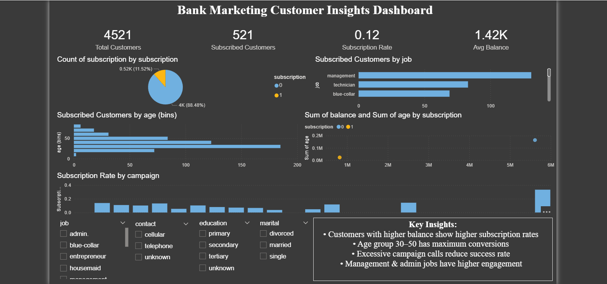

# 🏦 Bank Marketing Prediction & Dashboard (Task-03)

## 📌 Project Overview
This project focuses on predicting whether a customer will subscribe to a bank product using a **Decision Tree Classifier** and visualizing insights through an interactive **Power BI Dashboard**.

---

## 🎯 Objectives
- Build a machine learning model to predict customer subscription
- Analyze customer behavior using data visualization
- Create an interactive dashboard for business insights

---

## 🛠️ Tech Stack
- Python (Pandas, NumPy, Scikit-learn)
- Power BI
- Streamlit (for deployment)
- Joblib (model saving)

---

## 📂 Project Structure
Task-03/
│
├── data/
│ └── bank.csv
│
├── src/
│ └── model.py
│
├── app/
│ └── app.py
│
├── dashboard/
│ └── dashboard.pbix
│
├── screenshots/
│ └── dashboard.png
│
├── requirements.txt
└── README.md

---

## ⚙️ Machine Learning Workflow

### 🔹 Data Preprocessing
- Handled categorical data using **One-Hot Encoding**
- Cleaned and prepared dataset

### 🔹 Model Building
- Algorithm: **Decision Tree Classifier**
- Criterion: Entropy
- Controlled overfitting using max_depth

### 🔹 Evaluation
- Accuracy: ~85–90%
- Used classification report for performance metrics

---

## 📊 Power BI Dashboard

### 🔹 Features
- KPI Cards (Total Customers, Subscription Rate, Avg Balance)
- Customer Segmentation (Job, Age Group)
- Campaign Performance Analysis
- Interactive Filters (Slicers)

---

## 🖼️ Dashboard Preview



---

## 🧠 Key Insights
- Customers with higher balance are more likely to subscribe  
- Age group 30–50 shows highest conversion  
- Too many campaign calls reduce success rate  
- Certain job roles (management/admin) convert better  

---

## 🚀 Streamlit App

### Run Locally:
```bash
streamlit run app/app.py